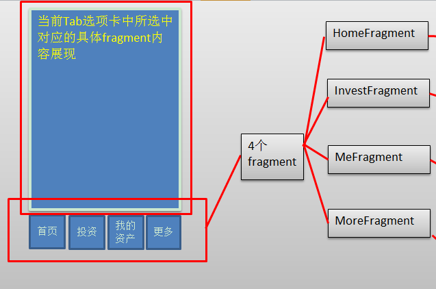
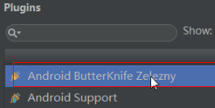

#p2p金融

- - -
## 1. App软件框架搭建


### 1.0软件基本架构


### 1.1创建MainActivity并设置布局文件
布局文件如下:
```
<?xml version="1.0" encoding="utf-8"?>
<LinearLayout xmlns:android="http://schemas.android.com/apk/res/android"
    android:orientation="vertical"
    android:layout_width="match_parent"
    android:layout_height="match_parent">
        <FrameLayout

            android:id="@+id/fl_main"
            android:layout_width="match_parent"
            android:layout_height="0dp"
            android:layout_weight="1"
            >
        </FrameLayout>

        <include  layout="@layout/buttom_button_main"/>
    </LinearLayout>

```
>其中: buttom_button_main.xml文件如下:(此处底部tab使用layout+image+text  可使用radiobutton更为简单)

```
<?xml version="1.0" encoding="utf-8"?>
<LinearLayout xmlns:android="http://schemas.android.com/apk/res/android"
    android:layout_width="match_parent"
    android:layout_height="55dp"
    android:orientation="vertical">

    <TextView
        android:background="@color/home_back_selected"
        android:layout_width="match_parent"
        android:layout_height="1dp" />
    <LinearLayout
        android:paddingTop="2dp"
        android:layout_width="match_parent"
        android:layout_height="54dp"
        android:orientation="horizontal">
        <LinearLayout
            android:id="@+id/ll_main_home"
            android:gravity="center"
            android:orientation="vertical"
            android:layout_weight="1"
            android:layout_width="50dp"

            android:layout_height="50dp">
            <ImageView
                android:id="@+id/iv_main_button_home"
                android:src="@drawable/bottom01"
                android:layout_width="30dp"
                android:layout_height="30dp" />
            <TextView
                android:layout_marginTop="2sp"
                android:text="首页"
                android:textSize="14sp"
                android:layout_width="wrap_content"
                android:layout_height="wrap_content" />
        </LinearLayout>

        <LinearLayout

            android:id="@+id/ll_main_invest"
            android:layout_weight="1"
            android:gravity="center"
            android:orientation="vertical"
            android:layout_width="50dp"
            android:layout_height="50dp">
            <ImageView
                android:id="@+id/iv_main_button_invest"
                android:src="@drawable/bottom03"
                android:layout_width="30dp"
                android:layout_height="30dp" />
            <TextView
                android:layout_marginTop="2sp"
                android:text="投资"
                android:textSize="14sp"
                android:layout_width="wrap_content"
                android:layout_height="wrap_content" />
        </LinearLayout>

        <LinearLayout

            android:id="@+id/ll_main_my"
            android:gravity="center"
            android:orientation="vertical"
            android:layout_weight="1"
            android:layout_width="50dp"
            android:layout_height="50dp">
            <ImageView
                android:id="@+id/iv_main_button_my"

                android:src="@drawable/bottom05"
                android:layout_width="30dp"
                android:layout_height="30dp" />
            <TextView
                android:layout_marginTop="2sp"
                android:text="我的"
                android:textSize="14sp"
                android:layout_width="wrap_content"
                android:layout_height="wrap_content" />
        </LinearLayout>
        <LinearLayout

            android:id="@+id/ll_main_more"
            android:layout_weight="1"
            android:gravity="center"
            android:orientation="vertical"
            android:layout_width="50dp"
            android:layout_height="50dp">
            <ImageView
                android:id="@+id/iv_main_button_more"
                android:src="@drawable/bottom07"
                android:layout_width="30dp"
                android:layout_height="30dp" />
            <TextView
                android:layout_marginTop="2sp"
                android:text="更多"
                android:textSize="14sp"
                android:layout_width="wrap_content"
                android:layout_height="wrap_content" />
        </LinearLayout>
    </LinearLayout>
</LinearLayout>

```


### 1.2 创建四个对应的Fragment 并加载对应的四布局文件

1) HomeFragment对应类
>com.example.chen.guigup2p.fragment.HomeFragment

```
/**

 * 1. HomeFragment --首页
 */

public class HomeFragment extends Fragment {
    @Nullable
    @Override
    public View onCreateView(LayoutInflater inflater, @Nullable ViewGroup container, @Nullable Bundle savedInstanceState) {

        View view = View.inflate(getContext(), R.layout.fragment_home,null);
        return  view;
    }
}
```
2)HomeFragment对应布局文件  
>layout/fragment_home.xml  

```
<?xml version="1.0" encoding="utf-8"?>
<LinearLayout xmlns:android="http://schemas.android.com/apk/res/android"
    android:orientation="vertical" android:layout_width="match_parent"
       android:layout_height="match_parent">

    <TextView
        android:text="首页"
        android:textSize="20sp"
        android:layout_width="match_parent"
        android:layout_height="match_parent" />
</LinearLayout>

```
其余三个fragment类似

### 1.3 实现不同Fragment间切换
#### 1.3.1 ButterKnife 框架使用
>1 安装插件



>2 导入到gradle文件

```
dependencies {
... ...
/*使用butterknife*/
    compile 'com.jakewharton:butterknife:7.0.1'
}
```

>3 MainActiviy中使用ButterKnife
使用注解初始化视图对象

```
public class MainActivity extends FragmentActivity {

    @Bind(R.id.fl_main)
    FrameLayout flMain;

    @Bind(R.id.iv_main_button_home)
    ImageView ivMainButtonHome;

    @Bind(R.id.ll_main_home)
    LinearLayout llMainHome;

    @Bind(R.id.iv_main_button_invest)
    ImageView ivMainButtonInvest;

    @Bind(R.id.ll_main_invest)
    LinearLayout llMainInvest;

    @Bind(R.id.iv_main_button_my)
    ImageView ivMainButtonMy;

    @Bind(R.id.ll_main_my)
    LinearLayout llMainMy;

    @Bind(R.id.iv_main_button_more)
    ImageView ivMainButtonMore;

    @Bind(R.id.ll_main_more)
    LinearLayout llMainMore;

    @Override
    protected void onCreate(Bundle savedInstanceState) {
        super.onCreate(savedInstanceState);
        setContentView(R.layout.activity_main);
        ButterKnife.bind(this);
        setSelect(1);

    }

}
```

>添加底部tab点击事件

```
@OnClick({R.id.ll_main_home, R.id.ll_main_invest, R.id.ll_main_my, R.id.ll_main_more})
    public void switchFragment(View view) {
        switch (view.getId()) {
            case R.id.ll_main_home:
                Toast.makeText(this, "首页", Toast.LENGTH_SHORT).show();
                setSelect(1);
                break;
            case R.id.ll_main_invest:
                Toast.makeText(this, "投资", Toast.LENGTH_SHORT).show();
                setSelect(2);
                break;
            case R.id.ll_main_my:
                Toast.makeText(this, "我的", Toast.LENGTH_SHORT).show();
                setSelect(3);
                break;
            case R.id.ll_main_more:
                Toast.makeText(this, "更多", Toast.LENGTH_SHORT).show();
                setSelect(4);
                break;

        }
    }
```


>切换fragment试图并更新按钮状态

```
    /**
     * 2. 设置要显示的Fragment
     * >更新button背景图        updateButton(i,oldButton);
     * @param i
     */
    private HomeFragment homefragment;
    private InvestFragment investfragment;
    private MyFragment myfragment;
    private MoreFragment morefragment;

    private int currentfragment = 1;  //标识当前显示的fragment的标号
    private int oldButton = 1;        //标识当前选中的button的标号

    private void setSelect(int i) {
        //通过事务生成并调用fragment
        FragmentManager manager = this.getSupportFragmentManager();
        FragmentTransaction transation = manager.beginTransaction();

        switch (i) {
            case 1://显示第一个fragment
                if (homefragment == null) {
                    homefragment = new HomeFragment();
                    transation.add(R.id.fl_main, homefragment);
                }
                checkFragment(i, transation);
                transation.show(homefragment);
                currentfragment = i;
                break;

            case 2://显示第二个fragment
                if (investfragment == null) {
                    investfragment = new InvestFragment();
                    transation.add(R.id.fl_main, investfragment);
                }
                checkFragment(i, transation);
                transation.show(investfragment);
                currentfragment = i;//更新当前fragment

                break;
            case 3://显示第三个fragment

                if (myfragment == null) {
                    myfragment = new MyFragment();
                    transation.add(R.id.fl_main, myfragment);
                }
                checkFragment(i, transation);
                transation.show(myfragment);
                break;
            case 4://显示第四个fragment

                if (morefragment == null) {
                    morefragment = new MoreFragment();
                    transation.add(R.id.fl_main, morefragment);
                }
                checkFragment(i, transation);
                transation.show(morefragment);
                break;

        }
        transation.commit();

        updateButton(i, oldButton);
        //更新索引
        currentfragment = i;
        oldButton = i;

    }

    /**
     * 3. 检测当前显示的fragment 是否是将要显示的fragment --隐藏非当前的fragment
     * @param i
     * @param transation
     */
    private void checkFragment(int i, FragmentTransaction transation) {
        if (i != currentfragment) {
            switch (currentfragment) {
                case 1: //隐藏home
                    transation.hide(homefragment);
                    break;
                case 2: //隐藏home
                    transation.hide(investfragment);
                    break;
                case 3: //隐藏home
                    transation.hide(myfragment);
                    break;
                case 4: //隐藏home
                    transation.hide(morefragment);
                    break;

            }
        }

    }

    /**
     * 4. 更新按钮状态
     *
     * @param i
     * @param oldButton
     */
    private void updateButton(int i, int oldButton) {

        Log.d("MainActivity", i + "---" + oldButton);
        //根据oldButton 还原 背景
        switch (oldButton) {
            case 1:
                ivMainButtonHome.setImageResource(R.drawable.bottom01);
                break;
            case 2:
                ivMainButtonInvest.setImageResource(R.drawable.bottom03);
                break;
            case 3:
                ivMainButtonMy.setImageResource(R.drawable.bottom05);
                break;
            case 4:
                ivMainButtonMore.setImageResource(R.drawable.bottom07);
                break;
        }

        //根据i 设置button 背景
        switch (i) {
            case 1:
                ivMainButtonHome.setImageResource(R.drawable.bottom02);
                break;
            case 2:
                ivMainButtonInvest.setImageResource(R.drawable.bottom04);
                break;
            case 3:
                ivMainButtonMy.setImageResource(R.drawable.bottom06);
                break;
            case 4:
                ivMainButtonMore.setImageResource(R.drawable.bottom08);
                break;
        }


    }

```


